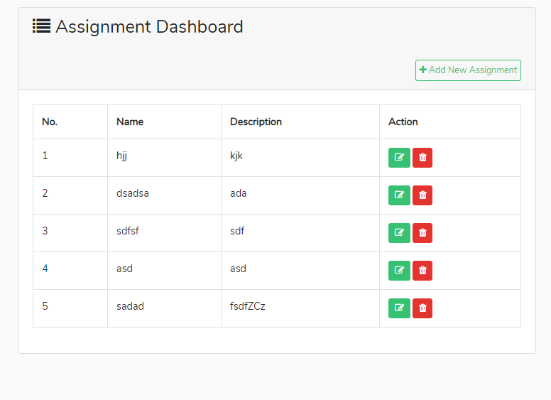

<p align="center"></p>
<p align="center"></p>
# To demonstrate the support, I decided to create a single page app in Laravel with a Vue.js powered frontend.

## We are going to use Laravel and  Vuejs

## Installation

Clone this repository

```bash
git clone https://github.com/imsat/spatask.git
```

Go inside the directory

```bash
cd spatask
```

Now install composer

```bash
composer install
```

Generate key on .env file

```bash
cp .env.example .env
php artisan key:generate
```

Npm Install and Build

```bash
npm install
npm run watch / npm run dev
```


## License

The Laravel framework is open-source software licensed under the [MIT license](https://opensource.org/licenses/MIT).
